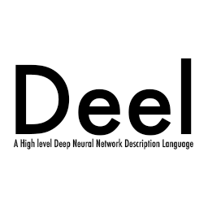

# Deel
Deel; A High level deep neural network description language.

You can create your own deep neural network application in a second.




## Goal
Describe deep neural network, training and using in simple syntax.

## Dependency

Chainer 1.7.1 or higher

Python 2.7.1

OpenCv 2.4.12 or higher

## Install and test

```sh
$ git clone https://github.com/uei/deel.git
$ pip install -r deel/requirements.txt
$ cd deel/data
$ ./getCaltech101.sh
$ cd ../misc
$ ./getPretrainedModels.sh
$ cd ..
$ python test.py
```

###Examples

####CNN classifier 
```python
deel = Deel()

CNN = GoogLeNet()

CNN.Input("deel.png")
CNN.classify()
ShowLabels()

```

####CNN trainer 
```python
nin = NetworkInNetwork()

InputBatch(train="data/train.txt",
			val="data/test.txt")

def workout(x,t):
	nin.classify(x)	
	return nin.backprop(t)

BatchTrain(workout)
```

####CNN classifier with OpenCV camera (you need OpenCV2) 
```python
import cv2 
from deel import *
from deel.network import *
from deel.commands import *

deel = Deel()

CNN = GoogLeNet()

cam = cv2.VideoCapture(0)  

while True:
	ret, img = cam.read()  
	CNN.Input(img)
	CNN.classify()

	labels = GetLabels()
	if labels[0][1] == 'Band':
		print 'BAND'
		cv2.imwrite('band.png',img)

	cv2.imshow('cam', img)
	if cv2.waitKey(10) > 0:
		break
cam.release()
cv2.destroyAllWindows()

```


####CNN-DQN with Unity (using with https://github.com/wbap/ml-agent-for-unity)
```python
from deel import *
from deel.network import *
from deel.commands import *
from deel.agentServer import *

deel = Deel()

CNN = AlexNet()
QNET = DQN()

def trainer(x):
	CNN.feature(x)
	return QNET.actionAndLearn()

StartAgent(trainer)
```


####CNN-LSTM trainer (done, not test)
```python
InputBatch(train="data/train_lstm.tsv")

CNN = GoogLeNet()
RNN = LSTM()

def trainer(x,t):
	CNN.classify(x) 
	RNN.learn(t)
	return RNN.backprop()

BatchTrain(trainer)
```

